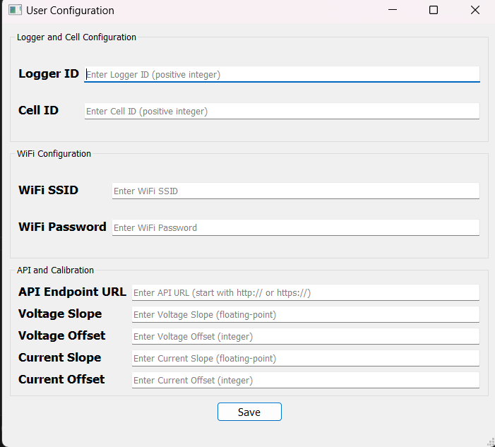

# GUI Application

## Overview

This PyQt5-based graphical user interface allows users to configure settings for a device. It includes fields for Logger ID, Cell ID, WiFi SSID, WiFi Password, API Endpoint URL, Voltage Slope, Voltage Offset, Current Slope, and Current Offset. Settings can be saved by clicking the save button.

## Installation

To install the required dependencies, use the following command:

```bash
pip install PyQt5
```

Run the application by executing the following command:

```bash
python user_config.py
```

## Screenshots

The following image is the user configuration App interfacing app:



## Structure

The project structure is organized as follows:

- user_config.py: Main GUI application file.
- config.json: Configuration file where settings are saved.
- README.md: This file providing an overview of the project.
