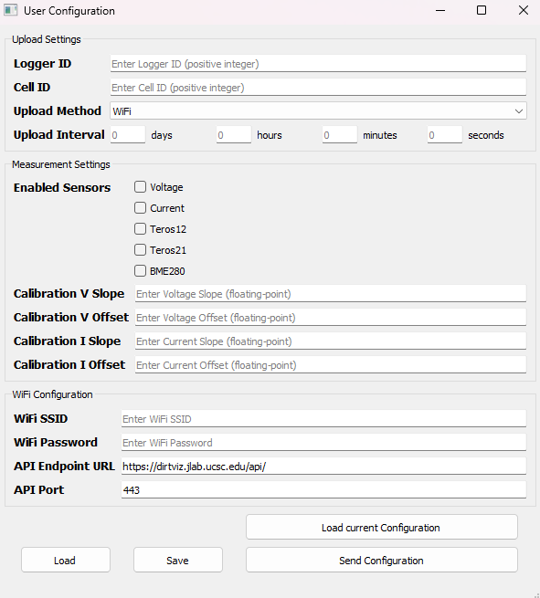
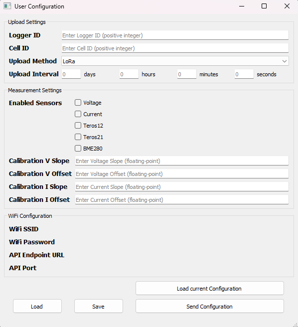
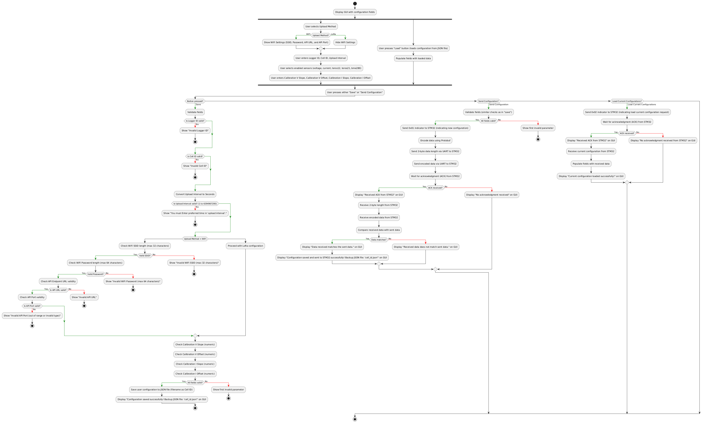

# GUI Application

## Overview

This PyQt5-based graphical user interface (GUI) allows users to configure settings for a device. It supports input fields for Logger ID, Cell ID, upload method (WiFi or LoRa), upload interval, enabled sensors, and calibration parameters for voltage and current (V/I Slope and Offset). Settings can be saved to a JSON file, loaded from a saved file, or directly transmitted to the device via UART.

The application provides options to:

- **Save configurations to a JSON file**
- **Load previously saved configurations**
- **Directly transmit settings to the device via UART**, using Protobuf for serialization.

## Key Features

- **Save and Load Configurations**: Save configurations to a JSON file named with the cell ID, or load an existing configuration.
- **Real-time Configuration Transmission**: Settings are serialized using Protobuf when the "Send Configuration" button is clicked, then transmitted over UART to the STM32 device.
- **Input Validation**: Ensures only valid data is entered, prompting error messages for any invalid fields to guide users.

## Installation

To install the required dependencies, use the following command:

```bash
pip install -r requirements.txt
```

Run the application by executing the following command:

```bash
python user_config.py
```

## Screenshots

### Application Screenshots

The following images show the GUI interface in different configurations:

|**WiFi Upload Method**|**LoRa Upload Method**|
|---------------------|-----------|
|||

### GUI Flow Diagram

The flow diagram below illustrates the general process and structure of the application:


