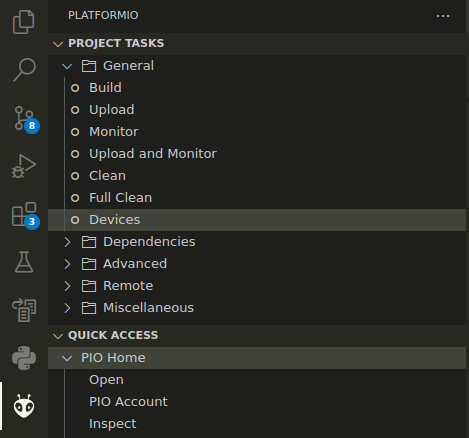

[](https://github.com/jlab-sensing/ents-node-firmware/actions/workflows/stm32.yaml) [](https://github.com/jlab-sensing/ents-node-firmware/actions/workflows/esp32.yaml) [](https://github.com/jlab-sensing/ents-node-firmware/actions/workflows/docs.yaml)

# Environmental NeTworked Sensor (ENTS) Firmware Developer Guide

Firmware repository for STM32 and ESP32 microcontrollers on the ENTS-node board along with supporting libraries. This repository acts as the central hub for all repositories related to the project.

## Project Structure

All components of the ENTS project are open source and live across a range of repositories. This repository serves as a central hub for all components for the project including software and hardware.

| Repository | Description |
| --- | --- |
| https://github.com/jlab-sensing/ents-node-firmware | Firmware for microcontrollers |
| https://github.com/jlab-sensing/platform-ststm32 | Fork with our board and modifications to build script |
| https://github.com/jlab-sensing/tool-openocd | For allowing for user defined `openocd` binary |
| https://github.com/jlab-sensing/STM32CubeWL | Platformio library for STMicroelectronics HAL and other libraries |
| https://github.com/jlab-sensing/soil_power_sensor | Hardware design files for the sensor board |

## File structure of repository

The following paths are the major parts of the project. Each individual folder has more information relating to implementation and development.

| Path | Description | Link |
| --- | --- | --- |
| `stm32/` | Platformio project for the stm32-based Wio-E5 mini | @ref ./stm32/README.md |
| `esp32/` | Platformio project for the ESP32-C3-MINI-N1 | @ref ./esp32/README.md |
| `proto/` | Protobuf definitions and language specific libraries | @ref ./proto/README.md |

## Software Requirements

The following is the list of the software used for developing the firmware. The versions listed were the ones used for developing the initial release of the firmware. Versions too far into the past might cause unforeseen errors.

| Software | Version | Optional |
| --- | --- | --- |
| [platformio](pio) | `6.1.7` | No |
| [stm32pio](https://github.com/ussserrr/stm32pio) | `2.1.0` | Yes, for code generation |
| [STM32CubeMX](https://www.st.com/en/development-tools/stm32cubemx.html) | `6.10.0` | Yes, for code generation |
| [STM32CubeIDE](https://www.st.com/en/development-tools/stm32cubeide.html) | `1.13.2` | Yes, for flashing with openocd on Windows |
| [STM32CubeProg](https://www.st.com/en/development-tools/stm32cubeprog.html) | `2.15.0` | Yes, for initial flash and clearing read protection from Wio-E5 |
| [Nanopb](https://jpa.kapsi.fi/nanopb/) | `0.4.8` | No |
| [protobuf](https://protobuf.dev/) | `25.2` | No |
| Make | `4.4.1` | No |

## Getting Started: Flashing firmware to microcontrollers

The Wio-E5 (stm32 based) and the esp32 have different methods of flashing but both use the [PlatformIO](pio) system. The VSCode extension is the most intuitive to use with setup instructions available [here](https://platformio.org/install/ide?install=vscode) and quick start guide available [here](https://docs.platformio.org/en/latest/integration/ide/vscode.html#quick-start). There is also a CLI interface that is similar to the `Make` build system with installation instructions varying depending on you OS. The [quick start guide](https://docs.platformio.org/en/latest/core/quickstart.html#process-project) is a good reference for common commands.

In VSCode PlatformIO extension requires a folder with a `platformio.ini` file for the project configuration. We recommend opening the root folder `ents-node-firmware` in VSCode than adding the `esp32` and `stm32` folders with *File/Add Folder to Workspace...*, then saving the workspace to the root project folder. The `.code-workspace` file should be automatically excluded from git. After all environments in both `esp32` and `stm32` should be available.

The Wio-E5 relies on a ST-Link JTAG interface with detailed instructions available at [stm/README.md](stm32/README.md). The esp32 uses a built in a bootloader that can be accessed over UART, detailed instructions are available at [eps32/README.md](esp32/README.md).

In both `stm32/platformio.ini` and `esp32/platformio.ini` the `upload_port`, `monitor_port`, and `test_port` will need to be changed to match the USB port. ***DO NOT*** change the `debug_port` as it will cause issues when launching the debugger. To get a list of connected devices in VSCode, click the following *PlatformIO Tab -> Project Tasks -> General -> Devices*. There is also an equivalent CLI command.

**VSCode**



**CLI**

```bash
pio device list
```

The following is the expected output with the Wio-E5 and ST-Link connected via USB. The esp32 port definition will depend on the USB to TTL used to interface with the exposed UART pins. In my case `/dev/ttyUSB0` with description *CP2102N USB to UART Bridge Controller* is the serial connection with the Wio-E5 module and `/dev/ttyACM0` is the ST-Link.

```
/dev/ttyUSB0
------------
Hardware ID: USB VID:PID=10C4:EA60 SER=fe18dcf14e87ed119ee029d7a603910e LOCATION=1-2
Description: CP2102N USB to UART Bridge Controller

/dev/ttyACM0
------------
Hardware ID: USB VID:PID=0483:3754 SER=004B00233033510635393935 LOCATION=1-4:1.1
Description: STLINK-V3 - ST-Link VCP Ctrl
```

The USB ports can be copied into `platformio.ini` as follows:

```ini
debug_port = localhost:3333
upload_port = /dev/ttyACM0

monitor_port = /dev/ttyUSB0
monitor_speed = 115200

test_port = /dev/ttyUSB0
test_speed = 115200
```

## Generation documentation

This project use [Doxygen](https://www.doxygen.nl/) for its code documentation. HTML documentation is automatically generated through Github Actions and is updated whenever there is a change to the `main` branch. To generate documentation locally in the `docs/` folder, run the following from the root directory:

```bash
doxygen Doxyfile
```

Online version of the documentation for the `main` branch is available at https://jlab-sensing.github.io/ents-node-firmware/

## Resources

Below is a list of resources that served as references throughout the design and implementation for the project.

- https://github.com/Seeed-Studio/LoRaWan-E5-Node

## Support

For issues relating to software create an issue in this repository. For hardware issues, create an issue in the [hardware repository](https://github.com/jlab-sensing/soil_power_sensor).

## Contributing

See [CONTRIBUTING.md](./CONTRIBUTING.md).

## Code of Conduct

This project adheres to
[Contributor Covenant](https://www.contributor-covenant.org).
See [Code of Conduct](./CODE_OF_CONDUCT.md) for a local copy.

## License

Code in this repository is licensed under the MIT License unless specified in the file header. See @ref LICENSE for full document.

## Maintainers

- [John Madden](mailto:jtmadden@ucsc.edu)

## Contributors

- [Steve Taylor](mailto:sgtaylor@ucsc.edu)
- [Varun Sreedharan](mailto:vasreedh@ucsc.edu)

[pio]: https://platformio.org/
