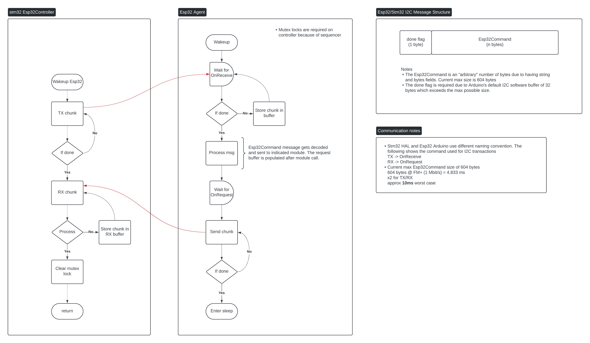

# Controller Interface

The `controller` library runs on the I2C *controller* devices to add functionality from externally connection microcontroller. Communication is performed over the I2C bus with a protobuf protocol to format data. For the ents system, we use library to add support for WiFi communication and additional storage through a micro SD card. Thus, the `controller` on the stm32 is written ontop STM Hardware Abstraction Layer (HAL) libraries that interface with the I2C peripherals.

The `module_handler` library runs on the external devices that provides the interface with the host. The device is configured as an I2C *target* devices and accepts protobuf encoded commands. The library is implemented using the [Arduino Wire library](https://docs.arduino.cc/language-reference/en/functions/communication/wire/).

The communication interface is based on a software layer transaction between the *controller* (stm32) and *target* (esp32). The *controller* controls the flow of communication by transmitting a command over the I2C interface and subsequently waiting to receive data back from the *target*. *Every transmit is followed by a receive!* This ensures that *target* devices with multiple functionality, ie. WiFi and SD card, aren't competing with the I2C to transmit data. The *target* looks at the protobuf serialized message to "forward" the data to the respective module. Since the size of messages exceeds the Arduino I2C buffer (32 for the Uno, 128 for esp32 implementations) the data is chunked with a single byte flag at the start of the serialized message used to indicate if data still needs to be communicated.

## Message Structure

Most commands consist of a **type**, indicating what action to perform, and **data**, that is used in the requested action. The same message is shared between transmit and receives between connected devices.

### TestCommand

The *TestCommand* message is used to test the communication at the software layer between the *controller* and *target* devices.

### WiFiCommand

The *WiFiCommand* message is used to control the WiFi hardware on the esp32 module. There are two types: (1) `CONNECT` which is used to connect to the WiFi network and (2) `POST` which sends data to an API endpoint.

The return code (`rc`) message serves dual purpose based on the type and direction of communication. For the `CONNECT`, the return code is used to send a WiFi enum directly from Arduino `WiFi.status()`. See [this file](https://github.com/arduino/wifishield/blob/0d0b242c794e3e91126fd72dbcca906829226128/firmware/wifiHD/src/wl_definitions.h#L28) for possible values. For `POST` the return code is used to store the HTTP response code from the *POST* request. See [HTTP status code](https://developer.mozilla.org/en-US/docs/Web/HTTP/Status) for possible values.

## Controller

## Module Handler
