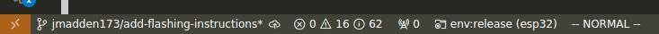
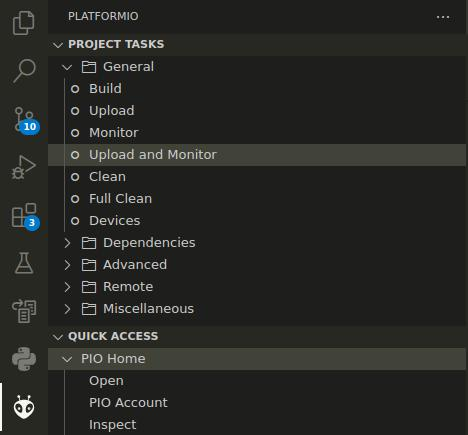

# ESP32 Firmware

The ESP32 firmware acts as a WiFi interface the STM32 module. It gets binary data through the I2C connection with the ESP32 and uploads it to a configured web address. The binary response is then passed back to the STM32 for decoding. The ESP32 handles *only* the WiFi interface. It is up to the STM32 to check all errors relating to decoding binary data.

## Flashing

> Before running the following ensure you have updated the ports in `platformio.ini` described in the root [README.md](../README.md).

The esp32 is programmed through a bootloader through UART. A USB to TTL convert is required to program the microcontroller with your computer and can be found cheaply online. Ensure it supports 3.3V logic levels.

### VSCode

Check the correct environment is selected. Should be `env:esp32 (esp32)`



Goto *PlatformIO Tab -> Project Tasks -> Upload and Monitor*



### CLI

The following can be used to flash the firmware on the esp32

```bash
pio run -e esp32 -t upload -t monitor
```

## Testing

We have included the python script `tools/http_server.py` to enable testing the WiFi interface of the ESP32. By default the server simulates a success POST request, returning a `200` response. The flag `--error` allows for a `418` to test error handling. See `http_server.py --help` for more usage information. We recommend hosting a WiFi network for the ESP32 on your local machine. An alternative is having your local machine and ESP32 connected to the same WiFi network. The following are instructions for testing the firmware on the ESP32:

1. **Configure local WiFi network (Optional)** If you are using a shared WiFi network, skip this step and set `ssid` and `pass` in the ESP32 firmware to the shared WiFi network. 

*Unix*

Create the hotspot using NetworkManager. Replace `ifname` with the name of your wireless interface.

```
nmcli dev wifi hotspot con-name spstesting ifname [ifname] ssid spstesting password "test1234"
```

To stop the hotspot.

```bash
nmcli connection down spstesting
```

To reactivate the hotspot.

```bash
nmcli connection up spstesting
```

To delete the connection.

```bash
nmcli connection delete spstesting
```

*macOS*

TODO

*Windows*

TODO


2. **Start HTTP server.** By default the server listens on all interface on port `8080`.

```bash
python http_server.py
```

3. **Update connection parameters for the WiFi network and server address.** The WiFi network should be the same network that your device connected to. Replace `[your ip address]` with the IP address of your local machine. By default the port is `8080`.

```c++
const char ssid[] = "spstesting";
const char pass[] = "test1234";

Dirtviz api("[your ip address]", 8080);
```

4. **Flash the ESP32.** Use the following command to select the correct environment for `example_dirtviz.cpp`. See [Flashing](#flashing) for more information.

```bash
pio run -e example_dirtviz -t upload
```

5. Monitor the server terminal and serial output to ensure data is being properly sent.