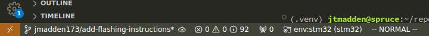

# STM32 Firmware

## Flashing the firmware

> Before running the following ensure you have updated the ports in `platformio.ini` described in the root [README.md](../README.md).

Connect the ST-Link to `D2` at the top of the board. Connect Wio-E5 to your computer using a USB-C cable.

### VSCode

Check the correct environment is selected. Should be `env:stm32 (stm32)`



Goto *PlatformIO Tab -> Project Tasks -> Upload and Monitor*


### CLI

To build and upload the firmware and open a serial monitor run the following command. You should see LoRaWAN EUIs printed and the device attempting to connect to a network.

```bash
pio run -e stm32 -t upload -t monitor
```

There are other firmware (mainly examples) that can be flashed to the board. For example the environment *example_adc* prints measurements and can be flashed with the following

```bash
pio run -e example_adc -t upload -t monitor
```

## Structure of `platformio.ini`

Since this project is monolithic and requires all components to be built together, the structure of @ref platformio.ini does not follow standard platformio practices. The default environment (`stm32`) builds the project with `main.c`. For the `example_battery` environment `main.c` needs to be excluded as follows

```ini
[env:example_battery]
build_src_filter = +<*> -<.git/> -<main.c> +<examples/example_battery.c>
```

Unit tests also require special handling as each one declares their own `main()`. You are able to debug tests by changing to the `tests` environment and launching the debug target.

```
[env:tests]
build_type = debug
build_src_filter = +<*> -<.git/> -<main.c> -<examples/*>
test_build_src = true

# uncomment with the test name to debug a test
debug_test = test_transcoder
```

This means that tests must be run with the following command

```bash
pio test -e tests
```

## Erasing the factory firmware with ST-Link 

The `Wio-E5 mini` board can be programed via *SWD* through the debug header `D1`. The following are instructions for using a `ST-Link` debugger to clear the read protection bits to allow for flashing and other programmers to be used. After a programmer should be plug-and-play to flash the stm32.

1. Connect the `ST-Link` debugger to header `D1`
2. Power the device
3. Press `RST` button
4. Press `BOOT` button
5. Release `RST` button
6. Release `BOOT` button
7. Press connect on the STM32CubeProgrammer interface.
	- If this is a new board, the stock firmware will be flashed. You will see the error message `Error: data read failed`. This is expected since the stock firmware has read protection.
		- On a new board you will need to disable read protection to fix the `Error: data read failed` error. Go to the `Option Bytes` tab (box with the letters "OB" on the left) and click `Read Out Protection`, set the RDP level to AA, or "no protection".
	- Otherwise, you see the current device memory.
8. Verify the target information in the lower right hand corner.

## Generating code with CubeMX

The project relies on the [CubeMX](https://www.st.com/en/development-tools/stm32cubemx.html) utility to initialize code. `CubeMX` uses the @ref stm32.ioc file to generate initialization code for various peripherals. This vastly decreases the development time of hardware based code. The `stm32pio` utility allows us to use `CubeMX` to generate code and structure the outputted files in a way that `platformio` recognizes. The project is already setup, therefore only the following command should be required to generate code whenever changes are made to @ref stm32.ioc

```bash
stm32pio generate
```

For more information on how the project was initially setup, see @ref create-pio-cubemx.

## Libraries

Below is a list of project specific libraries used for the firmware. See the individual pages for more detailed information. Typically libraries are code written by the developer, while files in `Src/` and `Inc/` are generated by CubeMX.

- @subpage bsp