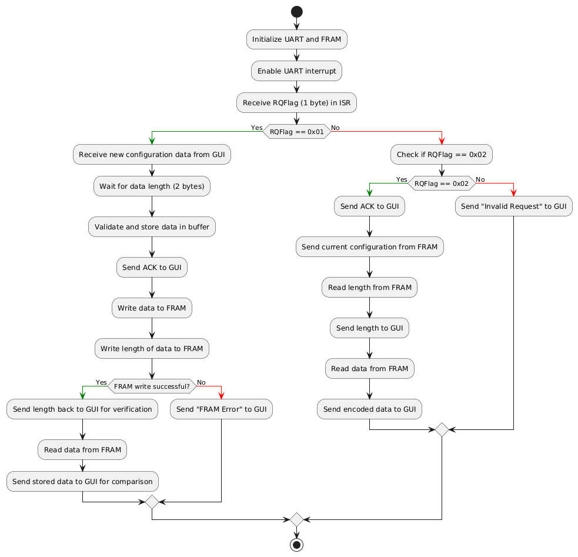
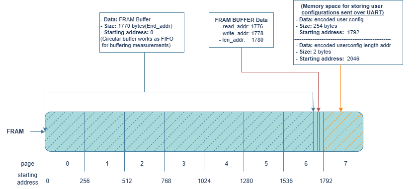

# Soil Power Sensor `userConfig` Library

**Author:** Ahmed Hassan Falah  
**Date:** 10/30/2024  
**Description:** The `userConfig` library enables efficient handling of user configuration data via UART communication and storage in FRAM on the STM32. It supports receiving and processing configuration data both via interrupt-driven and polling methods, writing the data to FRAM, and retrieving it when needed.

---

## Overview

The `userConfig` library initializes UART for interrupt-based data reception and handles incoming user configuration data. It writes and reads this data to and from the FRAM memory. The data length is stored alongside the encoded data in FRAM for easy retrieval.

## Features

- **UART Data Reception:** Uses interrupt-driven and polling methods to receive configuration data.
- **FRAM Data Storage:** Saves encoded configuration data in FRAM, along with its length.
- **Acknowledgment Messages:** Sends acknowledgment (`ACK`) to indicate successful data receipt.
- **Data Verification:** Ensures received data fits within the RX buffer, with error messaging if exceeded.

## Code Flow Diagram



The diagram illustrates the flow of code, from UART data reception to FRAM storage and acknowledgment transmission. It shows how the data is processed, validated, and stored in FRAM.

## FRAM Memory Usage



This diagram represents the FRAM memory layout, specifying where user configuration data and its length are stored.

## Memory Map

| Parameter                     | Address Hex (Dec)  | Length (Bytes) |
|-------------------------------|--------------------|----------------|
| **FRAM Start Address**        | `0x0700`    (1792) | -              |
| Encoded UserConfig Data Length| `0x0700`    (1792) | 2              |
| Encoded UserConfig Data       | `0x0702`    (1794) | 254 max        |
| Total FRAM Usage              | -                  | 256            |

The configuration data length parameter ensures that the library only reads the necessary amount of data from FRAM.

## Sending and Writing User Configuration to FRAM

To send and write user configuration data to FRAM, flash the `example_gui.c` file to the STM32 by entering the following command in your terminal:

```bash
pio run -e example_gui -t upload
```

After uploading successfully, run the GUI application by entering:

```bash
python user_config.py
```

Enter your preferred configuration settings in the GUI. When sent successfully, the STM32 will respond with acknowledgment (ACK), confirming the data receipt. If the data saved in FRAM matches the data sent, a confirmation message will pop up indicating success.

## Loading and Reading User Configuration from FRAM

To load the encoded user configuration data from FRAM into RAM and print the decoded values to the monitor, flash the `example_userConfig.c` by typing:

```bash
pio run -e example_userConfig -t upload -t monitor
```

After it successfully uploads, press the RESET button on the STM32 (labeled "RST") to see the stored user configurations. The terminal output will appear as follows if the configuration data was previously saved in FRAM:

```bash
--- Terminal on COM6 | 115200 8-N-1
--- Available filters and text transformations: colorize, debug, default, direct, hexlify, log2file, nocontrol, printable, send_on_enter, time
--- More details at https://bit.ly/pio-monitor-filters
--- Quit: Ctrl+C | Menu: Ctrl+T | Help: Ctrl+T followed by Ctrl+H

Logger ID: 5
Cell ID: 5
Upload Method: 0 "LoRa"
Upload Interval: 450000
Enabled Sensor 1: Voltage
Enabled Sensor 2: Teros21
Calibration V Slope: 5.000000
Calibration V Offset: 5.000000
Calibration I Slope: 55.000000
Calibration I Offset: 5.000000
WiFi SSID:
WiFi Password:
API Endpoint URL:
API Port: 0
```

**Note:** If you have not previously sent user configuration data from the GUI to the STM32, you may see the message `"Failed to load user configuration from FRAM."`
